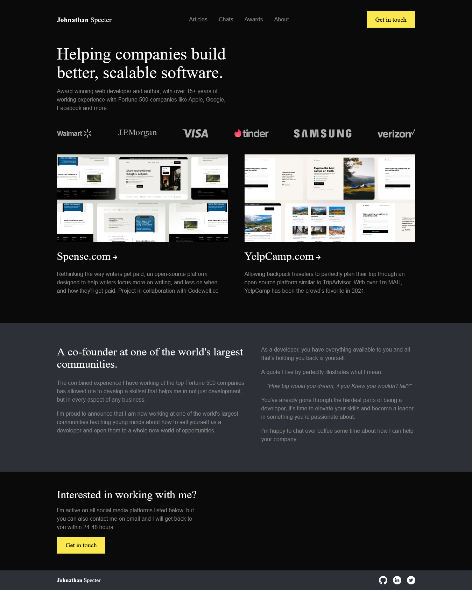

# Codewell.cc - Developer Portfolio solution

This is a solution to the [Developer Portfolio challenge on Codewell.cc](https://codewell.cc).
Codewell's aim is to provide you with real-world design templates that you can use to practice your HTML and CSS projects.

## Table of contents

- [Overview](#overview)
  - [The challenge](#the-challenge)
  - [Screenshot](#screenshot)
  - [Links](#links)
- [My process](#my-process)
  - [Built with](#built-with)
  - [What I learned](#what-i-learned)
  - [Continued development](#continued-development)
  - [Useful resources](#useful-resources)
- [Author](#author)
- [Acknowledgments](#acknowledgments)

## Overview

### The challenge

Users should be able to:

- View the optimal layout for the interface depending on their device's screen size
- See hover and focus states for all interactive elements on the page

### Screenshot

This is my solution 😃

### Links

- Solution URL 🌐: [solution source code](https://github.com/itsmusa/Developer-Portfolio-codewell.cc)
- Live Site URL 🌐: [live website](https://portfolio-three-pink-38.vercel.app/)

## My process

### Built with

- Semantic HTML5 markup ✔️
- CSS custom properties ✔️
- SASS ✔️
- Flexbox ✔️
- CSS Grid ✔️
- Mobile-first workflow ✔️

### What I learned
- This was a fun challenge. 😃
- I think I was able to keep things simple and not complicated. 👌

### Continued development

Going forward I want to continue using CSS grid and CSS animations as I am still not comfortable with them.

### Useful resources

- 🌐 [A Modern CSS Reset](https://andy-bell.co.uk/a-modern-css-reset/) - This helped me with CSS resets. I really liked this pattern and will use it going forward. 👌

- 🌐 [Boxicons Open Source icons](https://boxicons.com/) - icons 👌

- As always 🌐 [MDN web docs](https://developer.mozilla.org) 👌

## Author

- Github - [Musa Magwaza](https://www.github.com/itsmusa)
